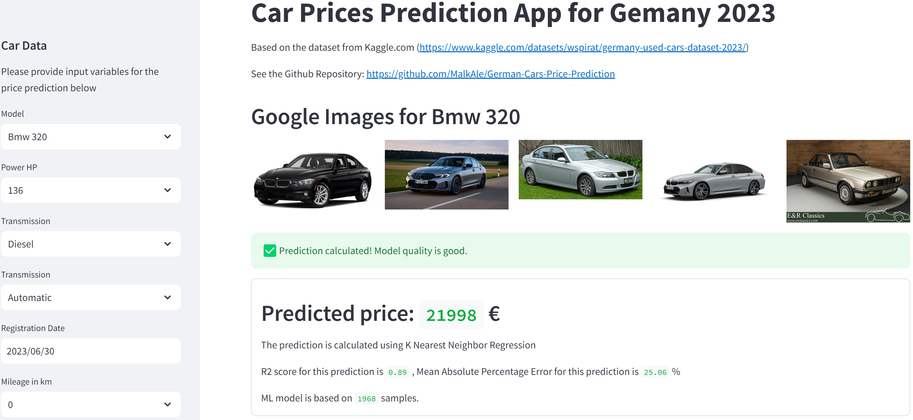
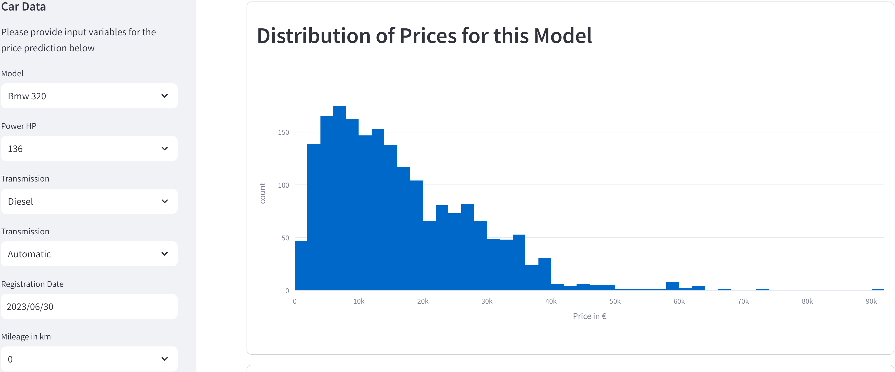
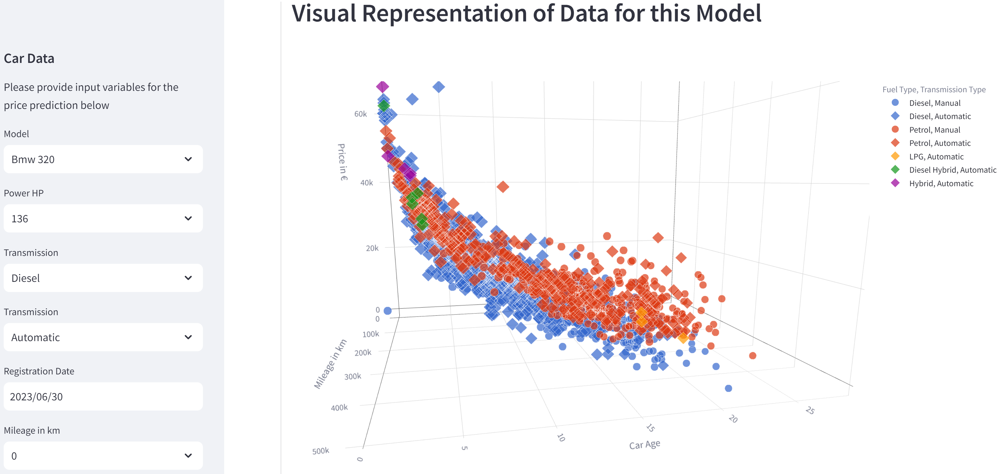

# German Cars Price Prediction App

A Streamlit web application that predicts used car prices in Germany using K-Nearest Neighbor regression, trained on a 2023 Kaggle dataset.

**Live deployment:** https://tbdbyxn5hy.eu-central-1.awsapprunner.com





## Data Source

[Germany Used Cars Dataset 2023](https://www.kaggle.com/datasets/wspirat/germany-used-cars-dataset-2023/) — available on Kaggle.

## Project Structure

```
.
├── app/
│   └── ger_cars_app.py       # Streamlit application
├── eda/
│   ├── ger_cars_model.py     # Model training script
│   ├── car_data.csv          # Raw dataset (not committed — large file)
│   └── car_data_ML.csv       # Preprocessed dataset (not committed — large file)
├── infra/
│   └── apprunner.yaml        # CloudFormation template (App Runner + S3 + IAM)
├── tests/
│   ├── conftest.py           # Shared fixtures and Streamlit mock
│   ├── test_app.py           # Unit tests for app logic
│   └── test_model_artifact.py# Structural tests for the trained model
├── .github/workflows/
│   ├── test.yaml             # Run tests on push to dev / PR to main
│   └── deploy_ecr_esc.yaml   # Build, push to ECR, deploy to App Runner on push to main
├── Dockerfile
├── pytest.ini
└── requirements.txt
```

## Architecture

**Training phase** (`eda/`): `ger_cars_model.py` reads the dataset, fits a separate KNN regression pipeline (MinMaxScaler + OneHotEncoder + KNN) per car model, filters models with R² < 0.4, and uploads artifacts to S3:
- `index.json` — lightweight index of all models (name → S3 key, R², MAPE)
- `models/<name>.joblib` — serialized sklearn pipeline per model
- `data/<name>.parquet` — training data per model

**App phase** (`app/`): `ger_cars_app.py` fetches `index.json` on startup, then lazy-loads the selected model's pipeline and data from S3 on first use (cached with `@st.cache_resource`).

## Regenerating and Uploading the Model

The model artifacts live in S3, not the repository. To regenerate and upload them:

```bash
export S3_BUCKET=<your-bucket-name>  # output of CloudFormation stack
cd eda
python ger_cars_model.py
```

This reads `car_data_ML.csv`, trains the models, and uploads all artifacts to the configured S3 bucket.

## Running Locally

Requires AWS credentials with S3 read access to the model artifacts bucket, and the `S3_BUCKET` environment variable set.

```bash
export S3_BUCKET=<your-bucket-name>
streamlit run app/ger_cars_app.py
```

The app runs on [http://localhost:8501](http://localhost:8501).

For Google Image Search, add to a `.env` file in the project root:

```
API_KEY=your_google_api_key
SEARCH_ENGINE_ID=your_custom_search_engine_id
```

## Running with Docker

The Docker build uses BuildKit secrets to inject Google API credentials at build time.

```bash
docker build \
  --secret id=api_key,env=API_KEY \
  --secret id=search_engine_id,env=SEARCH_ENGINE_ID \
  -t german_cars_app .

docker run -p 8501:8501 -e S3_BUCKET=<your-bucket-name> german_cars_app
```

## Deployment

The app runs on **AWS App Runner** (eu-central-1), deployed via the CloudFormation stack in `infra/apprunner.yaml`.

CI/CD is handled by GitHub Actions:
- Push to `dev` → runs the test suite
- Push to `main` (with changes in `app/` or `eda/`) → runs tests, builds Docker image, pushes to ECR, triggers App Runner deployment

## Tests

```bash
pip install -r requirements-dev.txt
pytest tests/ -v
```
