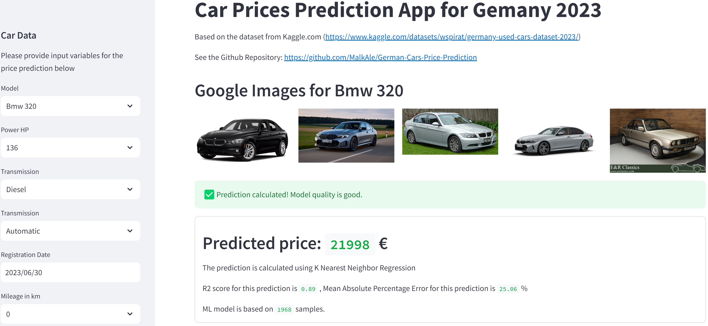
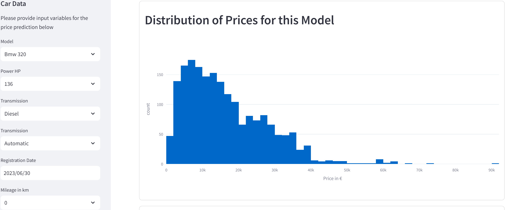
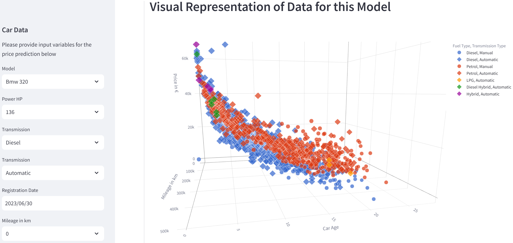

See deployment on AWS: http://german-cars-app-550107855.eu-central-1.elb.amazonaws.com/

•	Predicts prices for used cars based on user input based in dataset from kaggle.com
•	Uses cross-validation to select the best machine learning algorithm 
•	Streamlit web page to get user data and to display data 
<<<<<<< HEAD
•	Hosted on AWS ECS with CI/CD using Github Actions

=======
•	Hosted on AWS ECS with CI/CD using Github Actionshttp
>>>>>>> b0a36b7a1a88437cb9c85f2e95ed14fe13c27bb1
